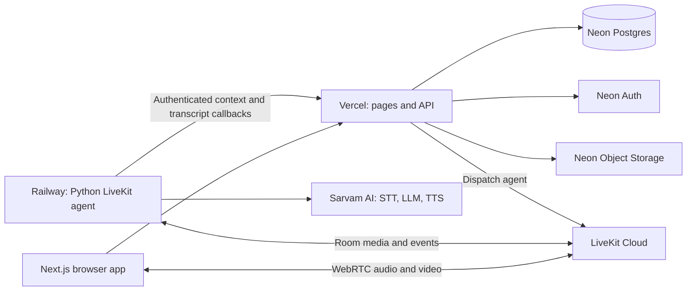

# Ari

**A human-centered AI interview platform for structured, conversational practice and hiring interviews.** Ari combines a live 3D interviewer, real-time voice, structured interview plans, and evidence-linked reports. Recruiters remain responsible for decisions; AI findings are reviewable and grounded in the interview transcript.

<p align="center">
  
</p>

## What Ari does

- **Practice interviews:** Candidates can rehearse for a target role, optionally use a saved resume, and review a personalized report.
- **Structured hiring interviews:** Teams prepare roles and interview outlines with consistent areas of focus.
- **Live conversations:** A browser joins a LiveKit room with Ari's Python agent. Sarvam provides speech recognition, conversation responses, and speech synthesis.
- **Evidence-linked reports:** Reports draw on confirmed transcript turns. Reviewers can inspect evidence and make their own ratings.
- **Candidate controls and privacy:** Camera use is optional. Ari does not retain raw interview audio; transcript retention and consent are presented in the product.

## How a live interview works

1. The candidate checks their microphone and optional camera, reviews the consent choices, and starts an interview.
2. Ari creates an interview record and room, then issues access for the browser and dispatches the LiveKit agent.
3. The candidate and agent exchange audio through LiveKit. The worker transcribes speech, generates follow-up prompts, speaks responses, and sends confirmed turns back to the app.
4. The candidate can **Leave** to exit their session or **End interview** to finish it. The app updates the interview lifecycle and makes the resulting report available when processing completes.

## Architecture



The web app and API run on Vercel. The Python agent is a long-running worker on Railway. Neon holds application data, authentication, and optional resume files. LiveKit carries live media; Sarvam provides AI voice services.

## Technology

| Area | Tools |
| --- | --- |
| Web app and API | Next.js 16, React 19, TypeScript |
| Live interviews | LiveKit WebRTC, LiveKit Agents for Python |
| Avatar | Three.js, TalkingHead, HeadAudio |
| Voice AI | Sarvam STT, LLM, and TTS |
| Data and sign-in | Neon Postgres, Prisma, Neon Auth |
| Resume files | Neon Object Storage (S3-compatible), optional |

## Repository layout

```text
app/                 Next.js pages and API routes
components/          Workspace, interview room, and avatar UI
lib/                 Auth, database, LiveKit, storage, and AI helpers
agent/               Python LiveKit agent worker
prisma/              Database schema and versioned SQL migrations
public/              Avatar and browser assets
docs/images/         README product screenshots
```

## Run locally

### Requirements

- Node.js 20 or newer
- Python 3.11 or newer and [uv](https://docs.astral.sh/uv/)
- A PostgreSQL database (Neon is supported)
- LiveKit project credentials
- Sarvam API key

### 1. Configure the web app

```bash
git clone https://github.com/AnuragTummapudi/Ari.git
cd Ari
npm install
cp .env.example .env
```

Fill in the required values in `.env`. Keep real secrets out of Git.

### 2. Prepare the database

Set `DATABASE_URL` to the Neon pooled connection and `DATABASE_URL_UNPOOLED` to the direct connection. Then run:

```bash
npx prisma generate
npx prisma migrate deploy
```

### 3. Start the app and worker

In one terminal, from the repository root:

```bash
npm run dev
```

In another terminal:

```bash
cd agent
uv sync
uv run python worker.py dev
```

Open [http://localhost:3000](http://localhost:3000).

## Deploy

### Vercel: web app and API

1. Import the repository into Vercel and use the repository root as the project root.
2. Add the **Vercel** variables listed in the table below for the Production environment (and Preview if needed).
3. Use the repository build command, `npm run build`. Prisma Client generation is configured by the project build setup.
4. Deploy. When changing environment variables, redeploy so the new deployment receives them.
5. Apply pending production database migrations with `npx prisma migrate deploy` from a trusted environment configured for the production database, or run this as a controlled CI deployment step.

`APP_URL` is for the agent's callbacks to the web API; set it on Railway to the public Vercel origin (for example, `https://ari-interview.vercel.app`). It is not required by the Vercel app.

### Railway: LiveKit agent

1. Create a service from this repository.
2. Set **Root Directory** to `/agent` in the service's Settings / Build configuration. If Railway's UI does not show that setting, keep the repository root and set the build/start commands to run from `agent`.
3. Use the worker start command `uv run python worker.py start` (with `uv` installed and dependencies synchronized during build).
4. Add the **Railway** variables listed below. Set `APP_URL` to the Vercel origin and make `INTERNAL_API_SECRET` identical to the Vercel value.
5. Deploy and confirm the worker is online and registered with LiveKit.

The agent is a persistent worker, not a web server. It does not need a public HTTP port or Railway domain for interview media; LiveKit provides the room connection.

### Neon, LiveKit, and Sarvam

- **Neon:** Create the Postgres database and Auth project. Configure the web app's `DATABASE_URL`, `DATABASE_URL_UNPOOLED`, and Neon Auth values. Keep storage credentials only if resume uploads use object storage.
- **LiveKit:** Create a project and use the same `LIVEKIT_URL`, `LIVEKIT_API_KEY`, and `LIVEKIT_API_SECRET` on Vercel and Railway.
- **Sarvam:** Set `SARVAM_API_KEY` on Vercel and Railway. The API uses it for report generation and document processing; the worker uses it for the live voice pipeline.

## Environment variables

Use `.env.example` as the source template. Never commit real credentials or paste them into issues or screenshots.

| Variable | Vercel | Railway | Purpose |
| --- | :---: | :---: | --- |
| `DATABASE_URL` | Required | — | Pooled Neon PostgreSQL URL used by the web API |
| `DATABASE_URL_UNPOOLED` | Required for migrations | — | Direct Neon PostgreSQL URL for Prisma migration operations |
| `NEON_AUTH_BASE_URL` | Required | — | Neon Auth endpoint; supplied by Neon project linking/configuration |
| `NEON_AUTH_JWKS_URL` | Neon-provided | — | Neon Auth signing-key endpoint; include if supplied by the Neon project integration |
| `NEON_AUTH_COOKIE_SECRET` | Required | — | Random secret of at least 32 characters for auth cookies |
| `INTERNAL_API_SECRET` | Required | Required (same value) | Authenticates worker callbacks to the web API |
| `APP_URL` | — | Required | Public origin of the Vercel app, e.g. `https://ari-interview.vercel.app` |
| `LIVEKIT_URL` | Required | Required (same value) | LiveKit WebSocket URL, typically `wss://<project>.livekit.cloud` |
| `LIVEKIT_API_KEY` | Required | Required (same value) | LiveKit server API key |
| `LIVEKIT_API_SECRET` | Required | Required (same value) | LiveKit server API secret |
| `LIVEKIT_AGENT_NAME` | Optional | Optional | Worker dispatch name; default is `ari-interviewer` |
| `SARVAM_API_KEY` | Required | Required | Sarvam API key for reports/documents and live voice respectively |
| `SARVAM_LLM_BASE_URL` | Optional | Optional | Sarvam-compatible API base URL; defaults to `https://api.sarvam.ai/v1` |
| `SARVAM_INTERVIEW_MODEL` | Optional | Optional | Live interview model; has an application default |
| `SARVAM_REPORT_MODEL` | Optional | — | Report model; has an application default |
| `SARVAM_TTS_SPEAKER` | — | Optional | Voice name; defaults to `priya` |
| `SARVAM_LANGUAGE_CODE` | — | Optional | Live interview language; defaults to `en-IN` |
| `SARVAM_DOCUMENT_LANGUAGE` | Optional | — | Resume/document language; defaults to `en-IN` |
| `AWS_ACCESS_KEY_ID` | Optional | — | Neon Object Storage access key, only when resume storage is configured |
| `AWS_SECRET_ACCESS_KEY` | Optional | — | Neon Object Storage secret key |
| `AWS_ENDPOINT_URL_S3` | Optional | — | Object Storage S3 endpoint |
| `AWS_REGION` | Optional | — | Object Storage region, if required by the bucket configuration |
| `NEXT_PUBLIC_ARI_AVATAR_GLB` | Optional | — | Browser-visible avatar path; defaults to `/avatars/ari.glb` |

`NEXT_PUBLIC_` values are included in browser code; never put secrets in variables with that prefix. Do not add `APP_URL` to Vercel just for this architecture—the worker needs it to call back to Vercel.

## Privacy and review

- Raw interview audio is streamed for the live conversation and is not retained by Ari in this version; confirmed transcript turns are stored for interview and report workflows.
- Camera participation is optional. Consent and transcript retention details are shown in the product before an interview starts.
- Observable session events are kept separate from skill evaluation. Looking away or a camera interruption is not itself a skills judgment.
- AI-generated findings support human review and do not make hiring decisions automatically.

## Assets and attribution

- [TalkingHead](https://github.com/met4citizen/TalkingHead) and [HeadAudio](https://github.com/met4citizen/TalkingHead) are used under their respective licenses.
- The bundled avatar attribution and licensing details are in [`public/avatars/ATTRIBUTION.md`](public/avatars/ATTRIBUTION.md).

## License

This project is licensed under the [MIT License](LICENSE).
