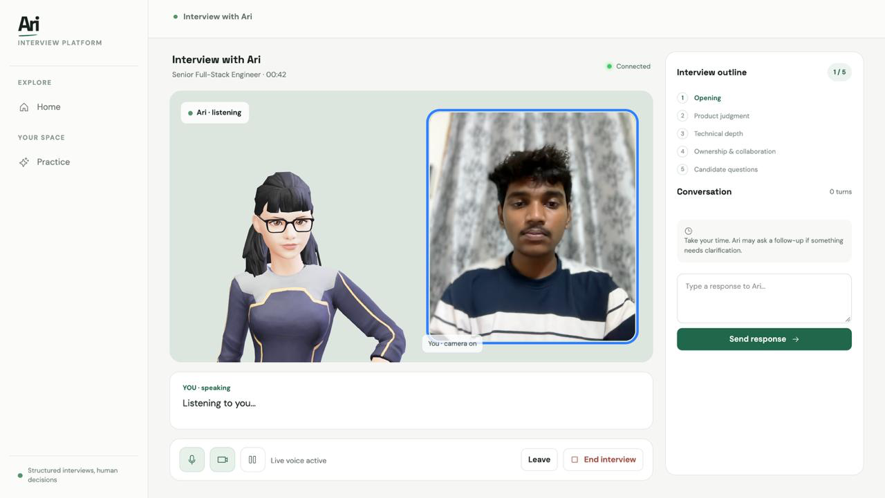
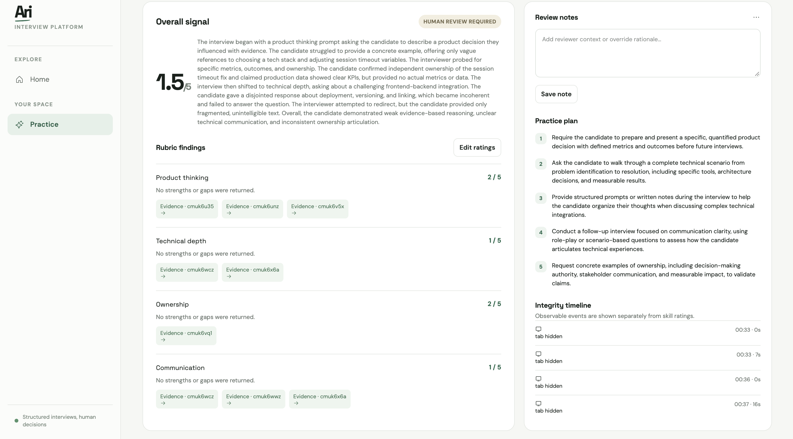
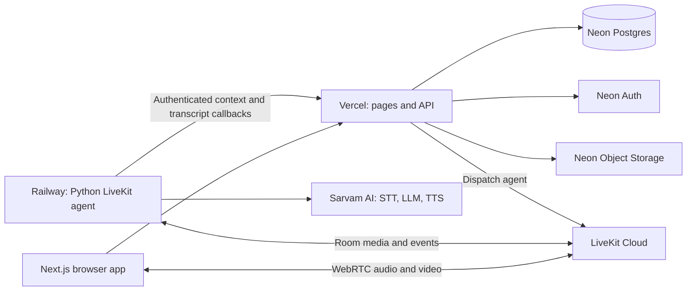

<p align="center">
  <picture>
    <source media="(prefers-color-scheme: dark)" srcset="docs/images/ari-logo.svg" />
    
  </picture>
</p>

<h3 align="center">Structured interviews. Human decisions.</h3>

<p align="center">
  An AI-powered interview platform for realistic practice and structured hiring conversations, with evidence-linked reports built for human review.
</p>

<p align="center">
  <a href="https://nextjs.org/"></a>
  <a href="https://react.dev/"></a>
  <a href="https://www.typescriptlang.org/"></a>
  <a href="https://livekit.io/"></a>
  <a href="https://www.sarvam.ai/"></a>
  <a href="https://neon.tech/"></a>
</p>

## Product screenshots

<p align="center">
  
</p>

<p align="center"><em>Live interview room: a structured outline, voice conversation, and candidate controls.</em></p>

<p align="center">
  
</p>

<p align="center"><em>Post-interview report: evidence-linked rubric findings and practice recommendations for reviewer consideration.</em></p>

## About Ari

Ari supports two interview workflows:

- **Practice:** Candidates rehearse for a target role, optionally using a saved resume, then review a personalized report.
- **Structured hiring:** Teams prepare role-specific interviews and assess candidates against consistent areas of focus.

The browser joins a LiveKit room with Ari's Python voice agent. The agent listens, asks follow-up questions, and speaks responses. Confirmed transcript turns support the post-interview report, where reviewers can inspect evidence and record their own notes or ratings. AI findings inform human review; Ari does not make hiring decisions automatically.

## Technology stack

| Product area | Stack |
| --- | --- |
| Web app and API | Next.js 16, React 19, TypeScript |
| Live interviews | LiveKit WebRTC, LiveKit Agents for Python |
| 3D interviewer | Three.js, TalkingHead, HeadAudio |
| Voice AI | Sarvam speech-to-text, language models, and text-to-speech |
| Database and sign-in | Neon Postgres, Prisma, Neon Auth |
| Resume files | Neon Object Storage (S3-compatible, optional) |
| Hosting | Vercel (web app), Railway (agent worker) |

## How an interview works

1. The candidate checks their microphone and optional camera, reviews the consent choices, and starts an interview.
2. Ari creates an interview record and LiveKit room, then issues access for the browser and dispatches the worker.
3. The candidate and agent exchange audio through LiveKit. The worker transcribes speech, generates follow-up prompts, speaks responses, and sends confirmed turns to the app.
4. The candidate can **Leave** to exit their session or **End interview** to finish it. Ari prepares a report from the interview transcript when processing completes.

## Architecture



The web app and API run on Vercel. The Python agent is a long-running worker on Railway. Neon holds application data, authentication, and optional resume files. LiveKit carries live media; Sarvam provides AI voice services.

## Run locally

### Requirements

- Node.js 20 or newer
- Python 3.11 or newer and [uv](https://docs.astral.sh/uv/)
- A PostgreSQL database (Neon is supported)
- LiveKit project credentials
- Sarvam API key

### 1. Install and configure

```bash
git clone https://github.com/AnuragTummapudi/Ari.git
cd Ari
npm install
cp .env.example .env
```

Fill in the required values in `.env`. Keep real secrets out of Git.

### 2. Prepare the database

Set `DATABASE_URL` to the Neon pooled connection and `DATABASE_URL_UNPOOLED` to the direct connection. Then run:

```bash
npx prisma generate
npx prisma migrate deploy
```

### 3. Start the app and worker

In one terminal, from the repository root:

```bash
npm run dev
```

In another terminal:

```bash
cd agent
uv sync
uv run python worker.py dev
```

Open [http://localhost:3000](http://localhost:3000).

## Deployment

### Vercel: web app and API

1. Import the repository into Vercel and use the repository root as the project root.
2. Add the **Vercel** variables listed in the table below for Production (and Preview if needed).
3. Use `npm run build`; Prisma Client generation is included in the project build command.
4. Deploy. Redeploy after changing environment variables.
5. Apply production database migrations with `npx prisma migrate deploy` from a trusted environment configured for the production database, or through a controlled CI deployment step.

`APP_URL` is for the worker's callbacks to the web API. Set it on Railway to the public Vercel origin (for example, `https://ari-interview.vercel.app`). It is not required by the Vercel app.

### Railway: LiveKit agent

1. Create a service from this repository.
2. Set the service root directory to `/agent` in Settings / Build configuration. If that control is unavailable, keep the repository root and use build/start commands that run from `agent`.
3. Configure the worker start command as `uv run python worker.py start`, with `uv` installed and dependencies synchronized during build.
4. Add the **Railway** variables listed below. Set `APP_URL` to the Vercel origin and make `INTERNAL_API_SECRET` match the Vercel value.
5. Deploy and confirm the worker is online and registered with LiveKit.

The agent is a persistent worker, not a web server. It does not need a public HTTP port or Railway domain for interview media; LiveKit provides the room connection.

### Service configuration

- **Neon:** Create the Postgres database and Auth project. Configure `DATABASE_URL`, `DATABASE_URL_UNPOOLED`, and the Neon Auth values on Vercel. Add storage credentials only when resume uploads use object storage.
- **LiveKit:** Use the same `LIVEKIT_URL`, `LIVEKIT_API_KEY`, and `LIVEKIT_API_SECRET` on Vercel and Railway.
- **Sarvam:** Set `SARVAM_API_KEY` on Vercel and Railway. The web app uses it for report generation and document processing; the worker uses it for the live voice pipeline.

## Environment variables

Use [`.env.example`](.env.example) as the source template. Never commit real credentials or paste them into issues or screenshots.

| Variable | Vercel | Railway | Purpose |
| --- | :---: | :---: | --- |
| `DATABASE_URL` | Required | — | Pooled Neon PostgreSQL URL used by the web API |
| `DATABASE_URL_UNPOOLED` | Required for migrations | — | Direct Neon PostgreSQL URL for Prisma migration operations |
| `NEON_AUTH_BASE_URL` | Required | — | Neon Auth endpoint; supplied by Neon project linking/configuration |
| `NEON_AUTH_JWKS_URL` | Neon-provided | — | Neon Auth signing-key endpoint, if supplied by the project integration |
| `NEON_AUTH_COOKIE_SECRET` | Required | — | Random secret of at least 32 characters for auth cookies |
| `INTERNAL_API_SECRET` | Required | Required (same value) | Authenticates worker callbacks to the web API |
| `APP_URL` | — | Required | Public origin of the Vercel app, e.g. `https://ari-interview.vercel.app` |
| `LIVEKIT_URL` | Required | Required (same value) | LiveKit WebSocket URL, typically `wss://<project>.livekit.cloud` |
| `LIVEKIT_API_KEY` | Required | Required (same value) | LiveKit server API key |
| `LIVEKIT_API_SECRET` | Required | Required (same value) | LiveKit server API secret |
| `LIVEKIT_AGENT_NAME` | Optional | Optional | Worker dispatch name; default is `ari-interviewer` |
| `SARVAM_API_KEY` | Required | Required | Sarvam API key for reports/documents and live voice respectively |
| `SARVAM_LLM_BASE_URL` | Optional | Optional | Sarvam-compatible API base URL; defaults to `https://api.sarvam.ai/v1` |
| `SARVAM_INTERVIEW_MODEL` | Optional | Optional | Live interview model; has an application default |
| `SARVAM_REPORT_MODEL` | Optional | — | Report model; has an application default |
| `SARVAM_TTS_SPEAKER` | — | Optional | Voice name; defaults to `priya` |
| `SARVAM_LANGUAGE_CODE` | — | Optional | Live interview language; defaults to `en-IN` |
| `SARVAM_DOCUMENT_LANGUAGE` | Optional | — | Resume/document language; defaults to `en-IN` |
| `AWS_ACCESS_KEY_ID` | Optional | — | Neon Object Storage access key, only when resume storage is configured |
| `AWS_SECRET_ACCESS_KEY` | Optional | — | Object Storage secret key |
| `AWS_ENDPOINT_URL_S3` | Optional | — | Object Storage S3 endpoint |
| `AWS_REGION` | Optional | — | Object Storage region, if required by the bucket configuration |
| `NEXT_PUBLIC_ARI_AVATAR_GLB` | Optional | — | Browser-visible avatar path; defaults to `/avatars/ari.glb` |

`NEXT_PUBLIC_` values are included in browser code; never put secrets in variables with that prefix. Do not add `APP_URL` to Vercel for this architecture—the worker needs it to call back to Vercel.

## Repository layout

```text
app/                 Next.js pages and API routes
components/          Workspace, interview room, and avatar UI
lib/                 Auth, database, LiveKit, storage, and AI helpers
agent/               Python LiveKit agent worker
prisma/              Database schema and versioned SQL migrations
public/              Avatar and browser assets
docs/images/         README logo and product screenshots
```

## Privacy and responsible review

- Raw interview audio is streamed for the live conversation and is not retained by Ari in this version; confirmed transcript turns support interview and report workflows.
- Camera use is optional. Consent and transcript retention details are shown before an interview starts.
- Observable session events are kept separate from skill evaluation. Looking away or a camera interruption is not itself a skills judgment.
- AI-generated findings support human review and do not make hiring decisions automatically.

## Assets and attribution

- [TalkingHead](https://github.com/met4citizen/TalkingHead) and [HeadAudio](https://github.com/met4citizen/TalkingHead) are used under their respective licenses.
- Bundled avatar attribution and licensing details are in [`public/avatars/ATTRIBUTION.md`](public/avatars/ATTRIBUTION.md).

## License

This project is licensed under the [MIT License](LICENSE).
